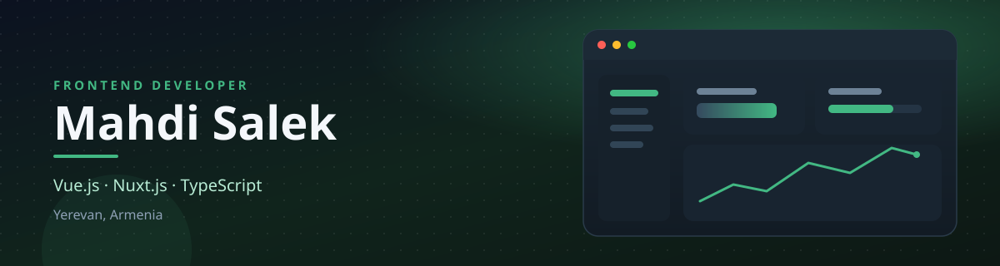
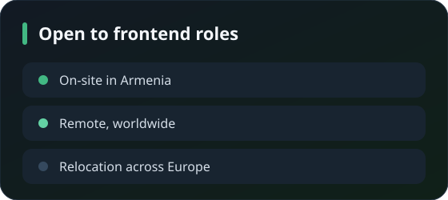
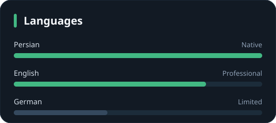

<!-- @format -->

  

  
  
  <!--  -->
  

 

<h3 align="justify">

Software Engineer with 7+ years of experience in Front-End Development, specializing in Vue.js and its ecosystem, including Nuxt.js and Vuetify. I hold a degree in Software Engineering and have contributed to a wide range of projects across startups and established companies.

In addition to front-end expertise, I have solid knowledge of back-end development, API design, and DevOps practices, enabling me to collaborate effectively across the entire product development lifecycle.

Over the past year, I have expanded my focus beyond engineering by studying product management and serving as a Project Manager in a growing startup. This experience has strengthened my leadership, planning, and cross-functional collaboration skills.

My long-term goal is to move into operational and product leadership roles, where I can combine technical expertise, business understanding, and team management to drive successful products and organizational growth.

</h3>

 
 

<table>
  <tr>
    <td width="50%">
      
    </td>
    <td width="50%">
      
    </td>
  </tr>
</table>

## Stack

  

  

  
  

## Certificates

  
  
  
  

## GitHub

<table>
  <tr>
    <td>
      
    </td>
    <td>
      
    </td>
  </tr>
</table>

  

  

## Contact

<h4 align="justify">

The fastest way to reach me is [Telegram](https://t.me/mahdi_s24). I am glad to talk about a frontend role, a product interface, or a team that needs someone who can code and also keep the work moving.

</h4>
